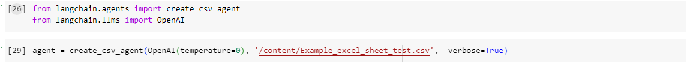
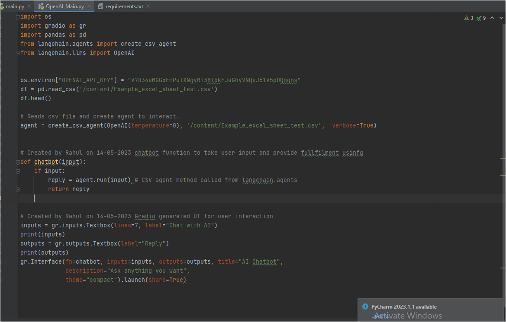

# OpenAI-Chatbot-with-Excel
### Langchain for Excel OpenAI is a system that combines the power of OpenAI's GPT-3 language model with Microsoft Excel to enable users to interact with Excel through natural language commands. The system uses OpenAI's GPT-3 to interpret user input and generate corresponding Excel commands, which are then executed in Excel. This allows users to perform tasks such as data analysis, visualization, and manipulation without the need for extensive knowledge of Excel functions and formulas.

## Table of Content
  * [openai](#openai)
  * [LangChain](#langchain)
  * [Code](#Code)
  * [Demo](#Demo)

## Langchain Excel Agent
Langchain Excel Agent is an intelligent assistant that helps users interact with Microsoft Excel through natural language commands. It uses cutting-edge artificial intelligence technologies to interpret user input and generate corresponding Excel commands, enabling users to perform various tasks such as data analysis, visualization, and manipulation more efficiently and easily. Langchain Excel Agent has the potential to significantly increase productivity and streamline workflows for Excel users, particularly those who are not experts in Excel functions and formulas.

## Code
 * First create new environment and install all the required packages and libraries.
 * Read csv file using pamdas library.
 * Create a csv reader agent from langchain.agents library.
 * Create a function/method named chatbot to pass user input/query.
 * Pass user query to csv_agent to process.
 * Implement gradio for interacting with chatbot.
 

## Demo
https://github.com/Raoul-Jadhav/OpenAI-Chatbot-with-Excel/assets/76778870/fe229210-b86a-406c-9d77-0223be1d2422

